# 숏폼의정석 — 숏폼 제작 스튜디오 랜딩페이지

> 소상공인·사업자를 위한 숏폼 영상 제작 서비스의 원페이지 랜딩사이트.
> **빌드 도구 · 프레임워크 없이** HTML / CSS / Vanilla JS 3개 파일로 구현했습니다.

<p>
  
  
  
  
  
</p>

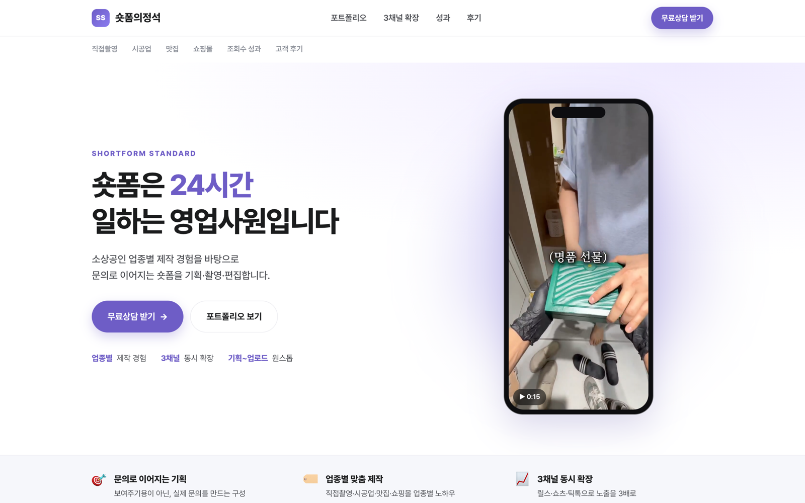

---

## 데모

### 1. 업종별 포트폴리오 탭 + 영상 모달

카드를 누르면 실제 제작 영상이 모달에서 바로 재생됩니다. 탭을 바꾸면 해당 업종 카드가 다시 렌더링됩니다.

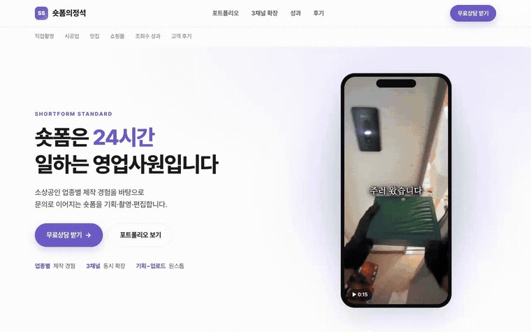

### 2. 3채널 확장 시뮬레이션

**영상은 그대로 두고 플랫폼 UI만 갈아끼우는** 인터랙션입니다.
쇼츠 / 틱톡 / 릴스 각각의 UI를 SVG 아이콘으로 직접 그려 재현했고, 좋아요 카운터는 실시간으로 올라갑니다.

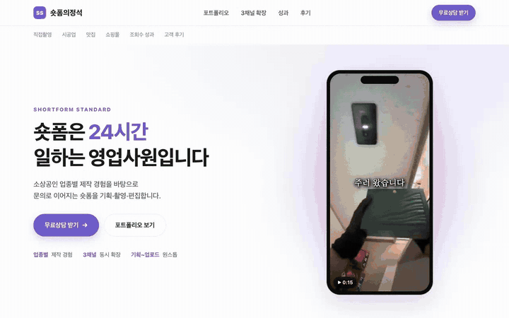

### 3. 모바일 스크롤 투어

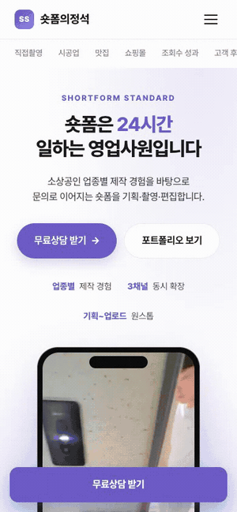

> 각 데모의 원본 영상: [demo-portfolio.mp4](docs/demo-portfolio.mp4) · [demo-channels.mp4](docs/demo-channels.mp4) · [demo-mobile.mp4](docs/demo-mobile.mp4)

---

## 화면

| 포트폴리오 | 3채널 확장 |
| --- | --- |
| 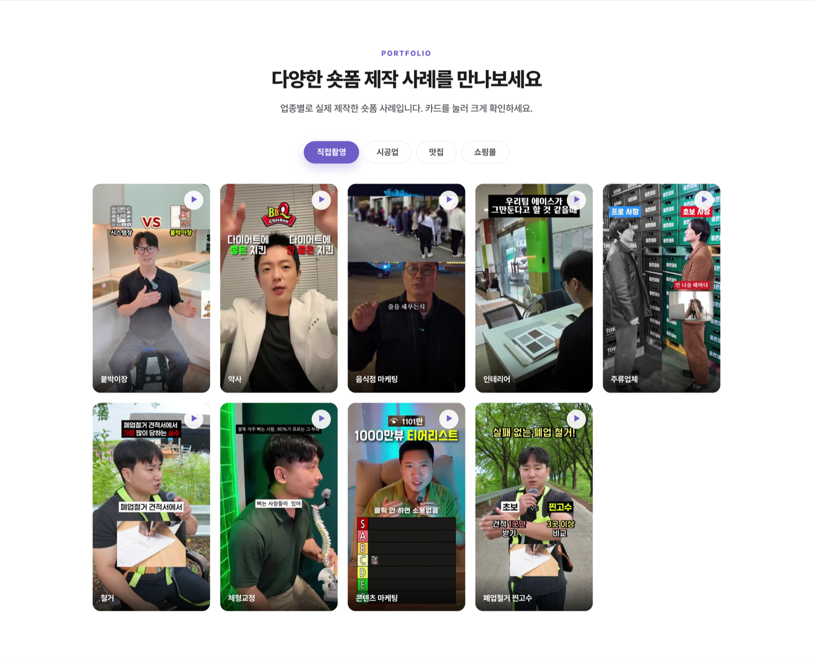 | 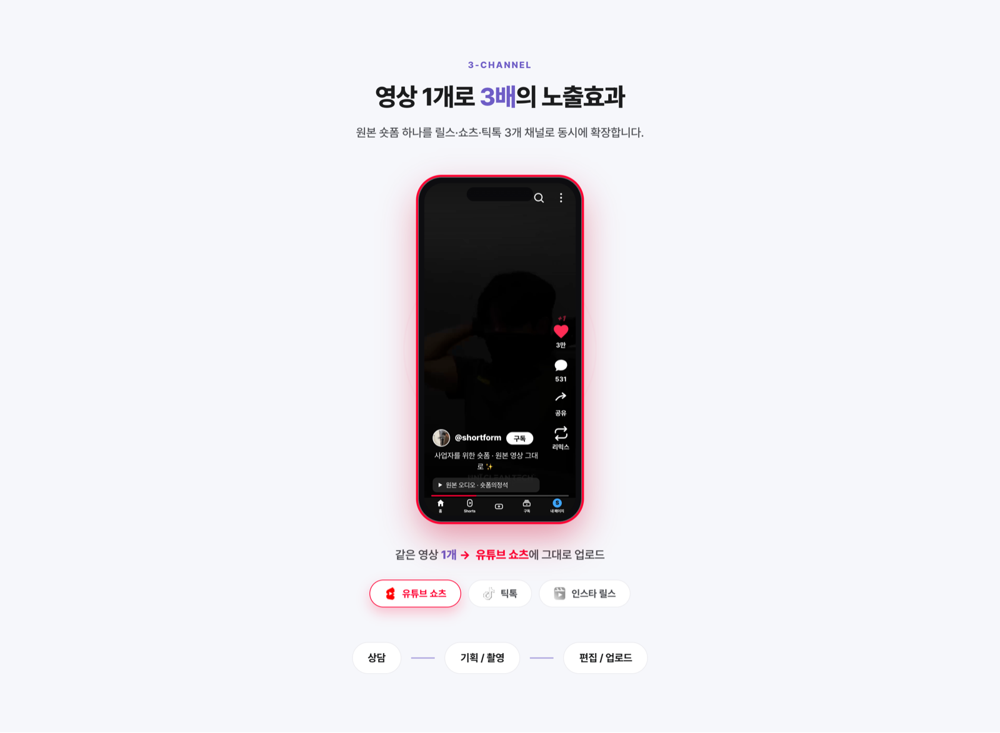 |

| 조회수 성과 | 고객 후기 |
| --- | --- |
| 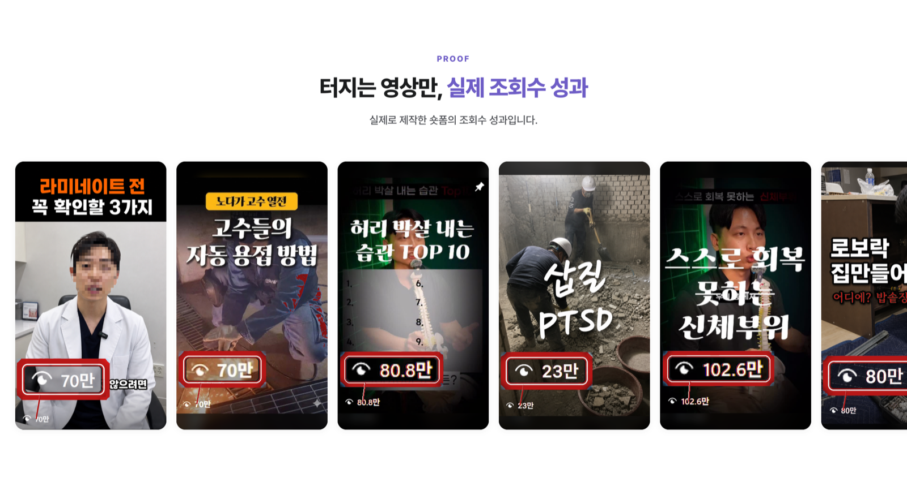 | 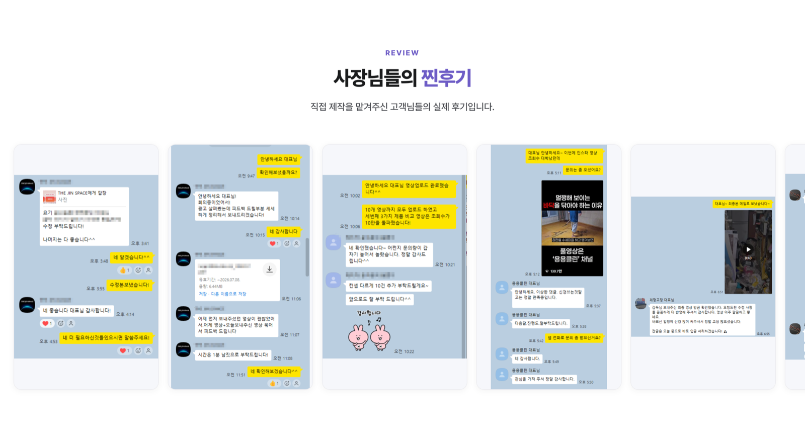 |

**상담 폼**

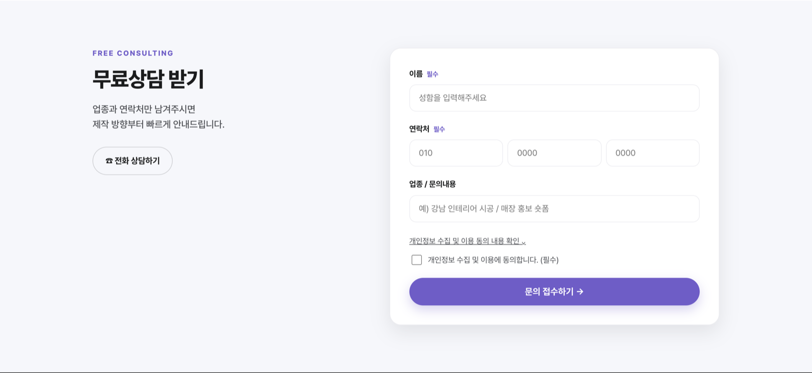

### 모바일

| 메인 | 포트폴리오 | 3채널 | 상담 폼 |
| --- | --- | --- | --- |
| 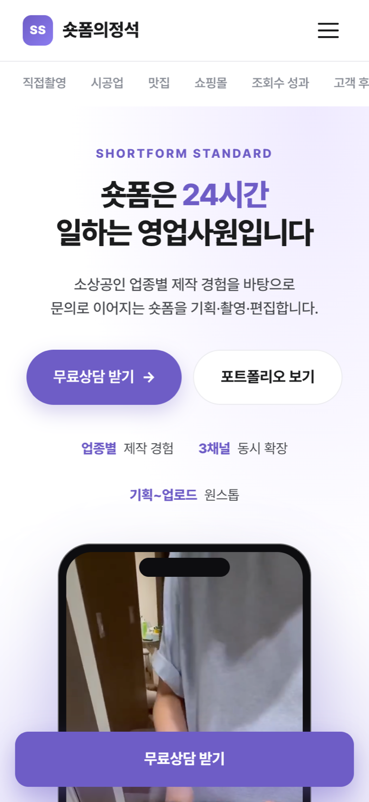 | 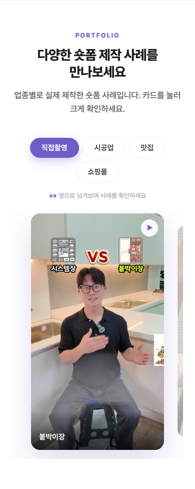 | 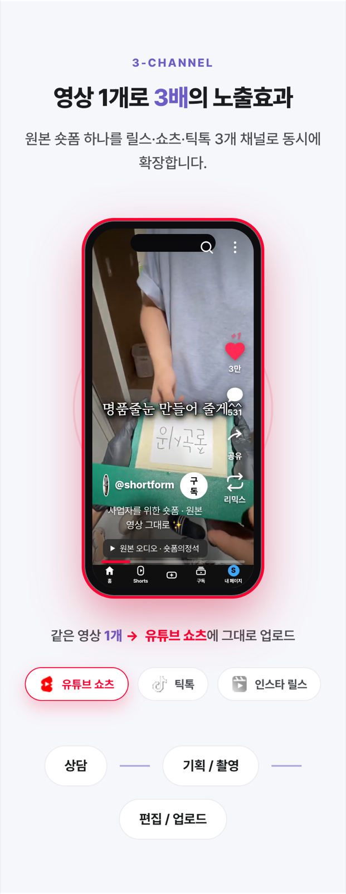 | 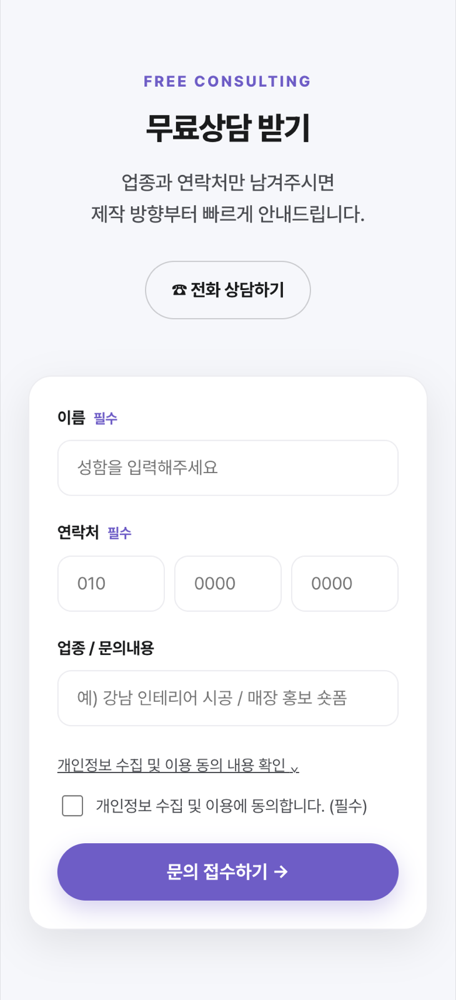 |

---

## 구현 포인트

| 기능 | 구현 내용 |
| --- | --- |
| **포트폴리오 탭** | 업종별 데이터 객체 하나로 카드를 동적 렌더링. 썸네일은 `loading="lazy"`, 클릭 시에만 mp4를 모달에 주입해 초기 로딩 비용 제거 ([script.js:40](script.js#L40)) |
| **3채널 UI 스와핑** | 플랫폼 3종의 UI를 모노톤 SVG로 직접 작성해 템플릿 문자열로 조립. 강조색(`--accent`)까지 함께 교체 ([script.js:134](script.js#L134)) |
| **라이브 좋아요 카운터** | 700ms마다 랜덤 증가 + `+1` 플로팅 애니메이션, 만/천/K 단위 포맷 ([script.js:286](script.js#L286)) |
| **모바일 캐러셀** | 가운데 카드 자동 강조(`markCenter`)와 3.2초 자동 넘김. 터치·휠 입력 시 5초 일시정지 ([script.js:102](script.js#L102)) |
| **스크롤 리빌 / 카운트업** | `IntersectionObserver`로 섹션 진입 시 애니메이션, 통계는 ease-out 큐빅으로 카운트업. 미지원 브라우저는 즉시 표시로 폴백 ([script.js:451](script.js#L451)) |
| **성능 최적화** | 화면 밖 섹션에서는 타이머 정지, 스크롤 핸들러는 `requestAnimationFrame` + `{ passive: true }` |
| **접근성** | `role="tablist"` / `aria-expanded` / `aria-hidden` 관리, ESC로 모달 닫기, 모달 오픈 시 배경 스크롤 잠금 |
| **상담 폼** | Formspree 연동. 폼 ID 미설정 시에도 동작하는 안내 모드 + 개인정보 수집 동의 검증 ([script.js:499](script.js#L499)) |

---

## 기술 스택

- **HTML5 / CSS3** — CSS 변수 기반 디자인 토큰, Flexbox·Grid, `clamp()` 반응형 타이포그래피
- **Vanilla JavaScript (ES6+)** — 의존성 0개, 번들러 없음
- **Pretendard** — 웹폰트 (CDN)
- **Formspree** — 서버리스 상담 폼 처리

---

## 프로젝트 구조

```
.
├── index.html      # 마크업 (헤더 / 히어로 / 포트폴리오 / 3채널 / 성과 / 후기 / 상담)
├── styles.css      # 디자인 토큰 + 전체 스타일 (반응형 포함)
├── script.js       # 렌더링·인터랙션 전체
├── assets/
│   ├── hero-mobile.mp4              # 히어로 영상
│   ├── portfolio-videos/<업종>/      # 포트폴리오 원본 영상
│   ├── portfolio-thumbnails/<업종>/  # 카드 썸네일
│   ├── 03_조회수섹션_사진넣기/        # 조회수 성과 이미지
│   └── 04_후기섹션_사진넣기/          # 고객 후기 캡처
└── docs/           # README용 스크린샷 · 데모
```

---

## 로컬 실행

빌드 과정이 없습니다. 정적 서버로 열기만 하면 됩니다.

```bash
git clone https://github.com/swandev618/shorts_homepage.git
cd shorts_homepage
python3 -m http.server 8000
# http://localhost:8000
```

상담 폼을 실제로 연동하려면 [script.js:496](script.js#L496)의 `FORMSPREE_ID`에 발급받은 폼 ID를 넣으세요.

---

## 라이선스 / 저작권

코드는 자유롭게 참고하셔도 좋습니다.
단, `assets/` 의 영상·이미지는 실제 고객사 제작물과 후기 캡처이므로 재사용할 수 없습니다.
